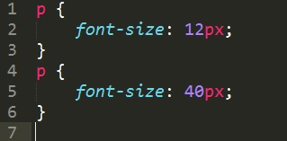
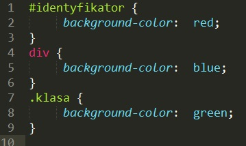

# CSS &ndash; Cascading style sheets

> Do the exercises in the ```index.html``` and ```css/style.css``` files

## Exercise done with the lecturer

### Understanding cascading (~ 3min - 5min)
Create one **paragraph**, give it the following styles and test how they work.




 -------------------------------------------------------------------------------

## Exercises to do on your own

### Exercise 1. Creating elements and adding styles (~ 3min - 5min)
Write two **paragraphs** and style each of them the following way:
* set ```font-size: 20px``` for the first one,
* set ```font-size: 10px``` for the second one.

###  Exercise 2. Styling multiple elements at once (~ 4min - 6min)
Create two **paragraphs** and one **span** element, and set a ```yellow``` background for all those elements.

###  Exercise 3. Understanding selector specificity (~ 5min - 7min)
Write one **div**. Fill it with short random text. Give it an id and a class. Then, style it in CSS in the following way:



 Check which background color will be assigned to the **div**.

###  Exercise 4. The keyword !important (~ 3min - 5min)
Return to the paragraph from exercise 1. Force it to use the first style (```font-size: 12px```) using the keyword ```!important```.
