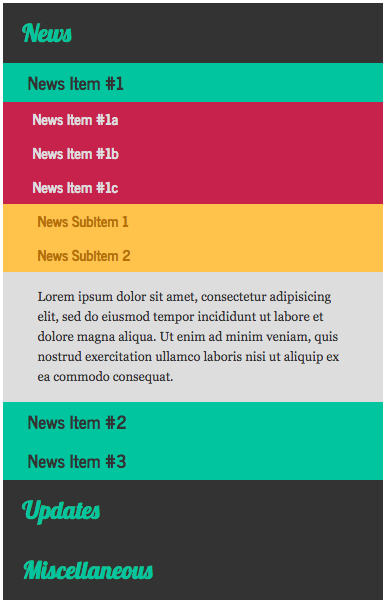
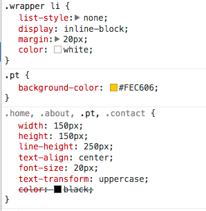
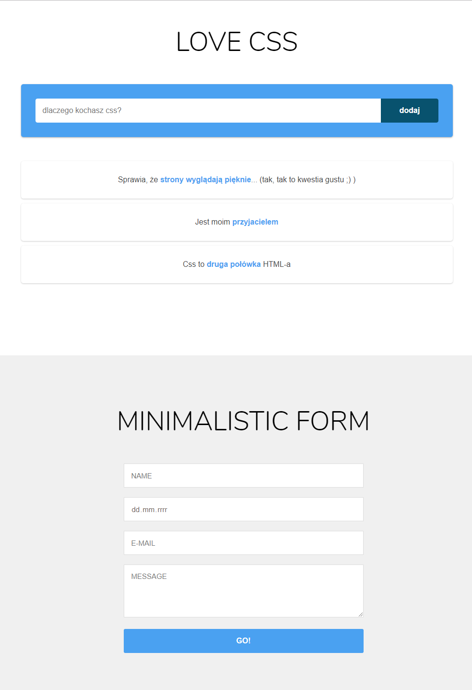

# CSS &ndash; Selectors


## Exercise done with the lecturer

###  News panel

Open the ```exercise1.html``` file. You will find there HTML code for a panel with sample news.
Unfortunately, it is a bit chaotic. Try to do the following steps so that the panel becomes more user friendly. Concentrate on selectors. Do the exercise in ```exercise1.css```

* Reset margin and padding for all elements using the universal selector ```*```
    > This will bring all elements closer to each other.

* Set the property ```cursor: pointer``` for the headers: ```h1, h2, h3, h4```. Remember to do this only for headers within the ```accordion``` element.
    > This way, when mouse cursor moves over the element, the cursor icon will change.

* Set the property ```display: none``` for all div elements, **and** for all paragraphs within the ```accordion``` element.
    > This will hide all elements besides h1 headers.

* Some elements have the ```opened``` class set in the HTML. Set the property ```display: block``` for these elements.
    > This will roll down some of the elements.

After you have finished, the news panel should have the following look:



-------------------------------------------------------------------------------

## Exercises to do on your own

### Exercise 2. Menu (~ 7min - 10min)

Open ```exercise2.html```. It contains a simple menu. Your task is to style it according to the following guidelines:

* Reset margin and padding for all elements using the universal selector ```*```

* Set background color for the entire menu to ```#003343```

* For all ```li``` elements within the ```wrapper``` element, set the following properties:
```CSS
    list-style: none;
    display: inline-block;
    margin: 20px;
    color: white;
```


* Set the following rule in the CSS file:
```CSS
.home, .about, .pt, .contact {
    width: 150px;
    height: 150px;
    line-height: 250px;
    text-align: center;
    color: black;
    font-size: 20px;
    text-transform: uppercase;
}
```

* For all ```li``` elements, set background color according to their class:
    * home - ```#3D8EB9```
    * about - ```#71BA51```
    * pt - ```#FEC606```
    * contact - ```#E75926```

*  Think about why the font color in boxes changed to black?
Look at the image below and try to explain why. Open Chrome Developer Tools and try to inspect the problem and fix it.




### Exercise 3. Form (~ 10min - 15min)

Open ```exercise3.html```. It contains two sections with forms. Both sections are styled in ```exercise3.css```. In the first one, there are commented CSS rules that do not have selectors. Starting from point 1, complete selectors so that the rules you are modifying, do not change the styles of the second form.

The final result: 


### Additional exercise  
Practice selectors on this page (first 14 lessons):
[flukeout.github.io](http://flukeout.github.io/ )
