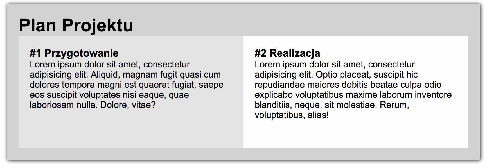
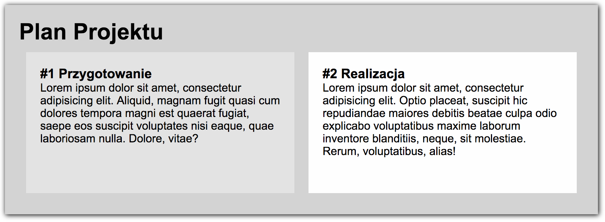

# CSS &ndash; Box Sizing

> Do the exercises in the ```index.html``` and ```css/style.css``` files.

## Exercise done with the lecturer

### Overflowing elements (~ 4min - 6min)

* Create a **div** with **container** class and set blue border and the width of 400px for it.
* Create another **div** with **one** class within it, and:
    * set its width to __350px__,
    * set a border (e.g. ```border: 1px solid red```),
* Write a couple of words in the **div** with **one** class. Now, move the text from the **div** border. Can you see that when you set padding, the element with **one** class does not fit in the **container** element?
* Fix it..


-------------------------------------------------------------------------------

## Exercises to do on your own

### Exercise 1. Box Sizing visualization (~ 2min - 4min)
Test how box sizes change with different box-sizing settings and with width, padding and border changes.
[Interactive box sizing diagram](http://codepen.io/carolineartz/full/ogVXZj/).

### Exercise 2. Modal that is too wide (~3min - 5min)

Mark is our client and he commissioned the developer to make a simple modal with a width of 400px. Unfortunately, the code he received is flawed. Mark reported a problem that the modal is too wide. Examine the appropriate item in the debugger, then resolve the problem in the **card.html** file and **card.css** file.

### Exercise 3. Fixes in the project plan (~5min - 10min)

In **plan.html** and **plan.css**, there is a recipe for baking a cake. Add code that will give the text inside the divs with classes: `card__column-left` and `card__column-right` 20px distance from the edges of these divs. Additionally, set border for these elements.



### Exercise 4. Fixes c.d. **for advanced students** (~5min - 10min)

Add 20px margins between divs (both horizontal and vertical) from the previous exercise. Use `calc()` method (https://developer.mozilla.org/en-US/docs/Web/CSS/calc)


