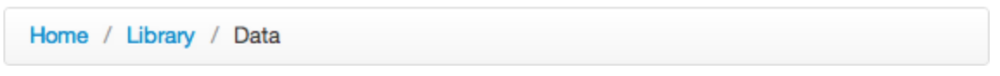

# CSS &ndash; Pseudoclass and pseudoelement


> Do the exercises in the ```index.html``` and ```css/style.css``` files.
> For the exercise done with the lecturer, use `navigation.html` and `css/navigation.css`

## Exercise done with the lecturer

### Navigation (~10min - 15min)

In **navigation.html** and **navigation.css** there is navigation prepared. Add the following functionalities:

* After hovering over the navigation element, change the background of this element to #E3E3E3
* The current list has a problem - it is not completely centered. This is due to the margin set on each item of the list. Fix the bug in such a way that the list is perfectly in the middle (use **:last-child**)
* Each element of the list should have its ornament (overturned 5x5px black square).

The final result:


-------------------------------------------------------------------------------

## Exercises to do on your own

### Exercise 1. Selector Game

Play the [flukeout.github.io](http://flukeout.github.io/).

### Exercise 2. Breadcrumb horizontal menu (~ 10min - 15min)

Create a breadcrumb horizontal menu. After hovering over a list element, the text should change color (from blue to black). It should look the following way:



### Exercise 3. Comment on the page (~ 5min - 7min)
In the **html** file, create a **div** with sample text and image (avatar). The avatar should be entered as a before pseudoelement.
A page for sample avatars: https://findicons.com/pack/1072/face_avatars

Style it the following way:


