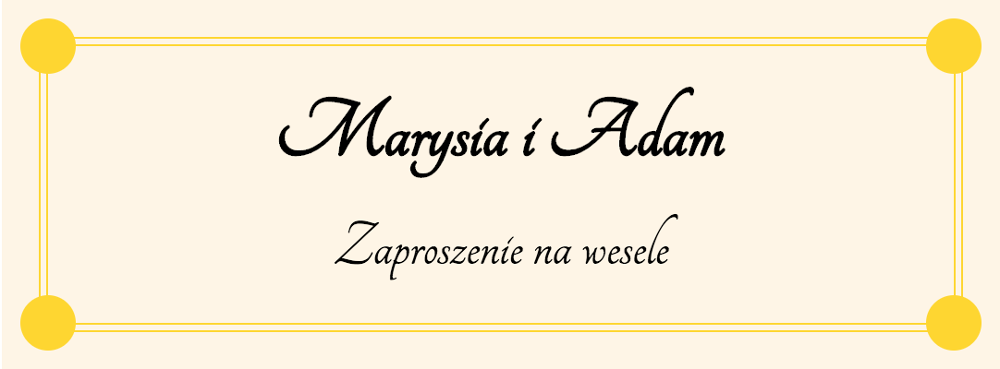
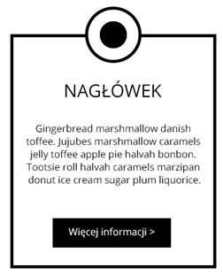
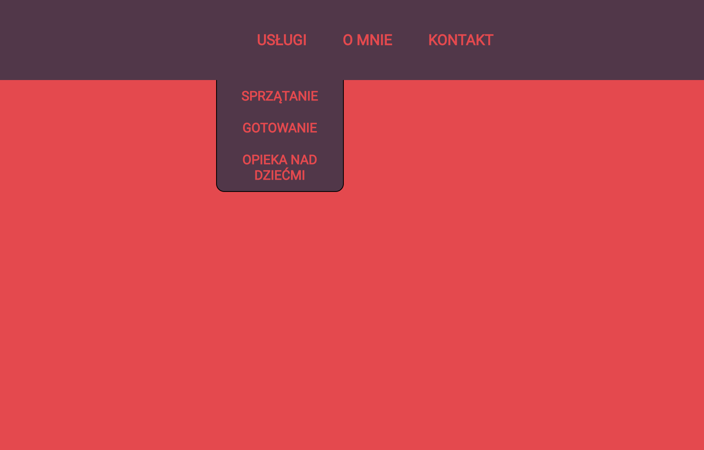

# CSS &ndash; Positioning elements

> Do the exercises in the ```index.html``` and ```css/style.css``` files.
> For the exercise done with the lecturer, use ```card.html``` and ```css/card.css```.
> For exercise 5, use ```dropdown.html``` and ```css/dropdown.css```.

## Exercise done with the lecturer

### Wedding invitation (~ 10min - 15min)

Mary and Adam are preparing invitations for their wedding reception. They did not have time for the last corrections. Use **position** to create circles that will decorate the card (in each corner there should be a gold circle with the dimensions of 30x30 px).



Do the exercise in `card.html` and `card.css`.

-------------------------------------------------------------------------------

## Exercises to do on your own

### Exercise 1. Positioning - recap (~ 4min - 6min)
Set the image as shown below. The image can be found in **images** catalog. The filename is ```jez.jpg```. Use the **float** property.


### Exercise 2. Positions (~ 4min - 6min)
Move the picture from the previous task as shown below. Use **position** property.


### Exercise 3. Third dimension (~ 4min - 6min)
In a **div**, create two images (they can be the same). Set **z-index** property for them as shown below.


### Exercise 4. Tab (~ 8min - 10min)

Create the following layout. Use the **position** property.



### Exercise 5. Dropdown menu (~ 10min - 15min)

Study the examples of positioning elements on the page: http://learnlayout.com/position.html.
Then, use your knowledge to create a dropdown menu as shown below.



Dropdown is to be permanently attached to the first element of the list (**Services**).

Do the exercise in `dropdown.html` and `dropdown.css`.

### Exercise 6. Dropdown menu - continued (~ 15min - 20min) **Dla zaawansowanych**

Using :hover state, hide and display the dropdown so that it shows when the mouse cursor lands on the text **Services**, and it hides when the cursor moves away.

Try to drop the menu down in such a way that its height is animated (use transition property).
