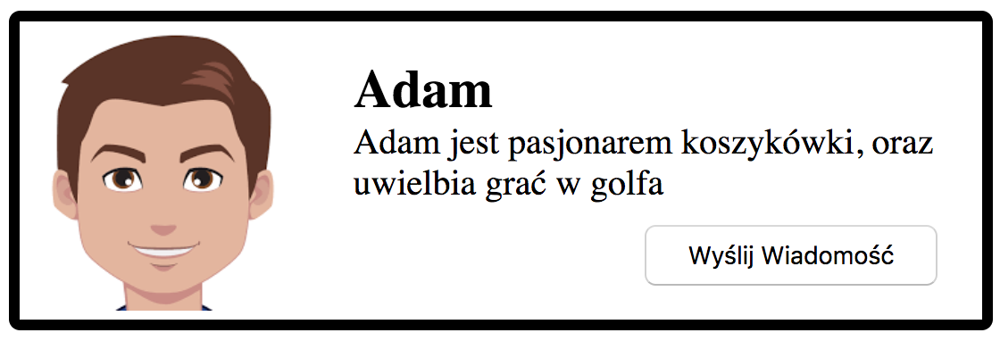
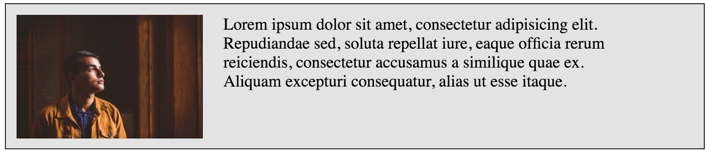
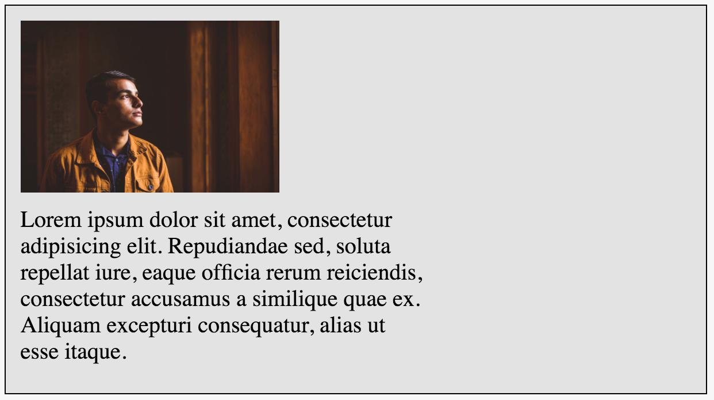
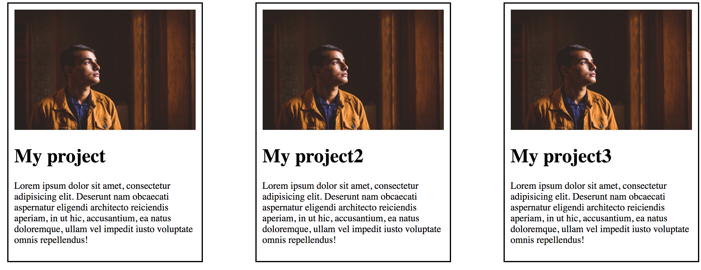
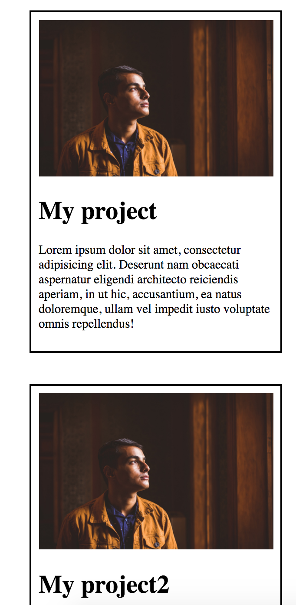

# CSS &ndash; Flexbox

## Exercise done with the lecturer

### Notification (~15min - 20min)

Do the exercise in  `notification.html` and `notification.css`. Using flexbox, create the element you see below on the page:

Guidelines:

* The image is centered vertically relative to the text
* `Send message` button is in the bottom right corner of the box (flexbox).

### Simple business card (~15min - 20min)

Do the exercise in  `card.html` and `card.css`. Your task is to create a business card as shown below:

Guidelines:

* Writing web pages, we cannot create a situation in which we have 4 words only in one line. Such text would be difficult to read. Make the text wrap under the photo when it does not fit next to the photo. It should look the following way:

* Test the flex-direction and flex-wrap properties. Make the photo appear on the right this time, and make it move to the bottom when wrapping.

-------------------------------------------------------------------------------

## Exercises to do on your own

### Navigation (~15min - 20min)

Do the exercise in  `index.html` and `style.css`. Using your knowledge about placement of elements on a page, create the layout that you below.

Guidelines:

* Use the flexbox to position elements side by side
* Logo and navigation must be as far away from each other as possible
* Logo and navigation must be in the middle of the header (centered vertically)

Additional information:

* background color: #E53C3D
* font color: #492F41

### Portfolio section on the page (~10min - 15min)

Do the exercise in  `portfolio.html` and `portfolio.css`. Create the following section using flexbox:

Guidelines:

* When shrinking the browser window, the elements should fall under each other and be in the middle of the page. See the example below:

