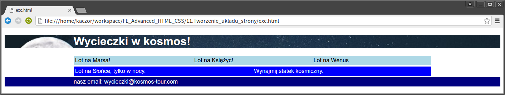

# CSS &ndash; Tworzenie układu strony

> Do the exercises in the ```index.html``` and ```css/style.css``` files.

## Exercise done with the lecturer

### Simple page layout (~ 10min - 12min)

Create a page as shown below:



Guidelines:

* header image: ```night-sky.jpg```,
* colors: ```lightblue```, ```blue```, ```navy```,
* font: Arial (do not forget about alternatives),
* pay attention to```padding``` and ```margin``` on colored stripes,
* divide the page appropriately (**section**, **header**, **footer**).
