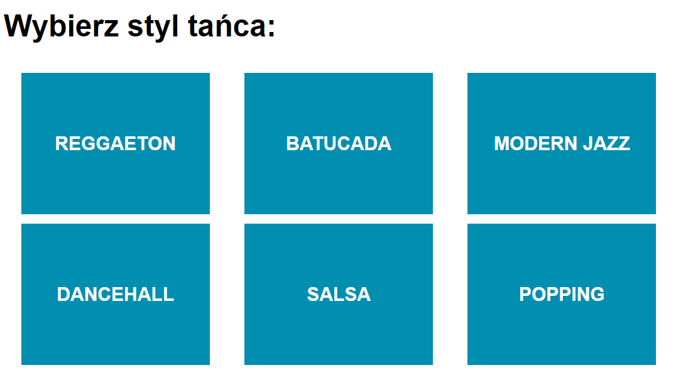

# Advanced HTML and CSS - homework

> Write the code in appropriate files according to exercise descriptions.

**VERY IMPORTANT - Your homework is checked using an automated system. In order for the answers to be considered correct, all the completed exercises MUST display the same content as in the exercise description!**

## Day 2

### Exercise 1. Mirage

Take a look at __index.html__. Create the following effect, using CSS only and not changing the HTML code. :


Guidelines:
* Element with __layer-1__ class has the width and height of ```800px``` and background color: ```#FF1106```,
* Element with __layer-2__ class has the width and height of ```600px``` and background color: ```#FF5200```,
* Element with __layer-3__ class has the width and height of ```400px``` and background color: ```#FF8B05```,
* Element with __layer-4__ class has the width and height of ```200px``` and background color: ```#FFCC0D```,
* Elements with __layer-2__, __layer_3__ and __layer-4__ classes are centered in relation to their parent,
* Using ```before``` and ```after``` pseudoelements, create and add to the elements with __layer-2__, __layer_3__ and __layer-4__ classes squares with sides ```100px``` long and appropriate colors. Place them in appropriate places (_Hint: the offset will always be ```50px``` - in an appropriate direction._).

### Exercise 2.

Take a look at __danceMenu.html__. There is HTML code ready.
Add CSS code in  __danceMenu.css__ to achieve a result as seen below. Use **flexbox**.

**Guidelines:**
* Box background: `#1496bb`,
* Boxa width: ```200px```,
* Box height: ```150px```;
* Font size: ```20px```,
* Font weight: ```700```,



